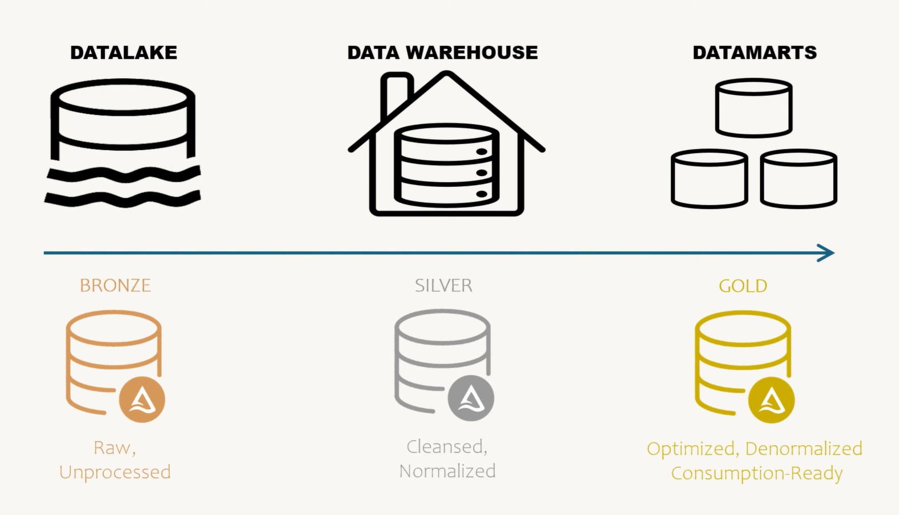
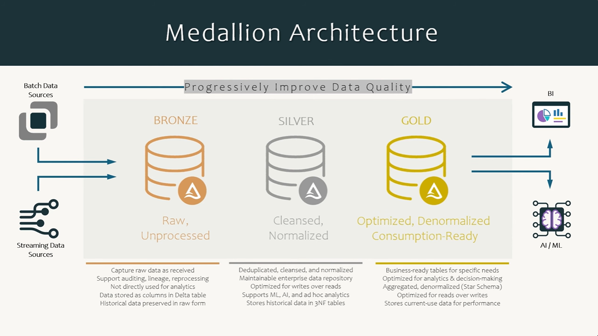

# Python Data Engineering — a Medallion Architecture you can run

A small, heavily commented, end-to-end data platform built to make the
**bronze → silver → gold** flow concrete. Every component is a container, every
transformation is a plain Python function, and the whole thing runs on a laptop
with one command.



The domain is **application log analytics**: services emit log events, and we turn
them into a dashboard that answers "what broke, when, and how slow are we?".

---

## The flow, end to end

```
  STREAMING SOURCE                         BATCH SOURCE
  live log events                          yesterday's rotated log files
  (MQTT / Mosquitto)                       (app-2026-08-30.log)
         │                                        │
         │ paho-mqtt subscriber                   │ daily Airflow DAG
         │ micro-batches (200 msgs / 30s)         │
         ▼                                        ▼
  ┌────────────────────────────────────────────────────────┐
  │  LANDING ZONE        lake/landing/{stream,batch}/       │   raw text, untouched
  └────────────────────────────┬───────────────────────────┘
                               │  layers/bronze.py
                               ▼
  ┌────────────────────────────────────────────────────────┐
  │  🥉 BRONZE   lake/bronze/event_date=…/event_hour=…/     │   Parquet, partitioned
  │              raw payload + lineage, nothing cleaned     │   "capture as received"
  └────────────────────────────┬───────────────────────────┘
                               │  layers/silver.py
                               ▼
  ┌────────────────────────────────────────────────────────┐
  │  🥈 SILVER   silver.log_events (DuckDB)                 │   typed, normalised,
  │              + rejected_events, load_audit, quality     │   de-duplicated, audited
  └────────────────────────────┬───────────────────────────┘
                               │  layers/gold.py
                               ▼
  ┌────────────────────────────────────────────────────────┐
  │  🥇 GOLD     dim_service, dim_date,                     │   star schema
  │              fct_log_events_hourly                      │        +
  │              mart_service_health_hourly                  │   flat marts
  │              mart_error_hotspots_daily                   │
  │              mart_pipeline_health                        │
  │              ⤷ exported to lake/gold_exports/*.parquet   │
  └───────────────┬──────────────────────────┬──────────────┘
                  ▼                          ▼
           FastAPI (:8000)            Streamlit (:8501)
           the serving contract       the BI layer

  Orchestrated end to end by Apache Airflow (:8080) — two DAGs, one per source.
```

---

## Quick start

```bash
git clone <this repo> && cd Python-Data-Engineering

make up            # builds and starts everything (first build takes a few minutes)
```

Then open:

| What | URL | Login |
|---|---|---|
| **Airflow** — watch the DAGs run | http://localhost:8080 | `airflow` / `airflow` |
| **API docs** — the serving contract | http://localhost:8000/docs | — |
| **Dashboard** — the BI layer | http://localhost:8501 | — |

The simulator starts immediately: it writes three days of batch log files, then
publishes ~5 live events/second to MQTT. Within ~5 minutes the streaming DAG has
run and the dashboard has data.

**Want to see the whole flow in ten seconds instead?**

```bash
make demo     # generates data and runs bronze → silver → gold in one process
```

That runs [`src/pipeline/demo.py`](src/pipeline/demo.py), which calls exactly the
same functions the Airflow DAGs call — no orchestrator, no containers, just the
data moving. It is the best place to start reading.

Other useful targets (`make help` lists them all):

```bash
make logs                  # follow every container
make backfill DAYS=7       # generate a week of previous-day log files
make dags                  # trigger the daily batch DAG right now
make test                  # run the test suite
make reset                 # wipe all generated data and start clean
```

---

## Why each tool is here

| Tool | Role | Why this one |
|---|---|---|
| **MQTT / Eclipse Mosquitto** | Streaming transport | The lightweight pub/sub protocol IoT devices and log forwarders actually speak. Producers and consumers never know about each other. |
| **paho-mqtt** | Stream ingestor | Subscribes and writes micro-batches. Deliberately does no transformation, so ingestion can never be blocked by a downstream bug. |
| **Parquet + PyArrow** | The data lake (bronze) | Columnar and compressed: silver can scan one column of millions of rows cheaply, and the files stay readable by any engine forever. |
| **DuckDB** | The warehouse (silver + gold) | An embedded columnar OLAP database — "SQLite for analytics". Real warehouse SQL with zero operations. See [docs/storage-choices.md](docs/storage-choices.md). |
| **Apache Airflow** | Orchestration | Schedules, retries, backfills, and shows you what ran. It orchestrates the pipeline; it deliberately does not *contain* the pipeline. |
| **FastAPI** | Serving layer | One HTTP contract over the gold marts for every consumer, plus an HTTP→MQTT ingestion gateway for producers that cannot speak MQTT. |
| **Streamlit** | BI / dashboard | Pure Python dashboards. Reads gold marts and draws them — no business logic lives here. |
| **Docker Compose** | Packaging | Nine services, one command, identical on every machine. |
| **pytest** | Confidence | The transformations are plain functions, so they are testable without Airflow or Docker. |

### Storage: the recommendation

**Parquet in the lake for bronze, DuckDB for the silver + gold warehouse.**

DuckDB is a genuine columnar analytical database that installs with `pip` and
stores everything in one file — the pragmatic Python-native warehouse. It reads
Parquet in place, so the lake itself is queryable, and the SQL you write against
it transfers directly to Snowflake or BigQuery.

Its single limitation — **one read-write process at a time** — shaped the design
rather than being hidden by it:

* only Airflow writes, serialised by a cross-process file lock;
* FastAPI and Streamlit never open the warehouse file; they read the **gold
  Parquet exports** through an in-memory DuckDB. No locks, and a running pipeline
  can never take the dashboard down.

That "serve from the mart, not from the warehouse" split is exactly what large
platforms do, so the constraint teaches the right habit.

[**docs/storage-choices.md**](docs/storage-choices.md) compares DuckDB against
Postgres, ClickHouse, Delta/Iceberg and the cloud warehouses, and lists the
concrete signals that say it is time to graduate.

---

## Repository layout

```
├── docker-compose.yml          # the whole platform: 9 services
├── Makefile                    # make up / demo / test / reset ...
├── docker/                     # one Dockerfile per component + mosquitto.conf
├── requirements/               # pinned deps, split per image
│
├── src/pipeline/               # ALL the business logic (no Airflow imports here)
│   ├── config.py               # every path and tunable, in one place
│   ├── schemas.py              # the data contract + log parsing
│   ├── warehouse.py            # DuckDB access: writer lock, reader isolation, DDL
│   ├── quality.py              # the checks that gate publication
│   ├── simulator.py            # generates demo events (and deliberate bad data)
│   ├── demo.py                 # runs the whole flow in one process
│   ├── sources/
│   │   ├── mqtt_stream.py      # STREAMING: MQTT → landing zone micro-batches
│   │   └── log_files.py        # BATCH: previous days' rotated log files
│   └── layers/
│       ├── bronze.py           # landing → partitioned Parquet
│       ├── silver.py           # bronze → cleansed, de-duplicated warehouse table
│       └── gold.py             # silver → star schema + marts + Parquet export
│
├── airflow/dags/
│   ├── medallion_streaming_dag.py   # every 5 min: promote MQTT micro-batches
│   └── medallion_batch_dag.py       # daily: yesterday's log file, with a sensor
│
├── services/
│   ├── api/main.py             # FastAPI serving layer + ingestion gateway
│   └── dashboard/app.py        # Streamlit dashboard
│
├── tests/                      # unit + end-to-end tests on a temp data root
└── data/                       # generated at runtime (git-ignored)
    ├── lake/{landing,bronze,quarantine,archive,gold_exports}/
    └── warehouse/medallion.duckdb
```

**The structural rule worth stealing:** business logic lives in `src/pipeline/`
and knows nothing about Airflow. The DAGs are thin — each task is one function
call. That is what makes the transformations testable, runnable outside the
orchestrator, and portable if you ever replace Airflow.

---

## What each layer actually does



### 🥉 Bronze — `src/pipeline/layers/bronze.py`

Converts the *container* (text → Parquet) and never the *content*.

* Keeps the original JSON verbatim in `raw_payload`, so a silver bug can be fixed
  by reprocessing rather than by begging the source system for history.
* Adds lineage on every row: `source_type`, `source_file`, `ingested_at`.
* Partitions by **event** time (`event_date=…/event_hour=…`), so reprocessing one
  day touches one directory.
* Lines that are not parseable text go to `lake/quarantine/` with a reason —
  never silently dropped.
* Landing files move to `archive/` only *after* the Parquet is safely written, so
  a crash mid-run costs a retry, not data.

### 🥈 Silver — `src/pipeline/layers/silver.py`

Where the data becomes trustworthy. One SQL statement per idea:

1. **Parse** typed columns out of the JSON payload.
2. **Normalise** — `WARNING`/`warn`/`Err` all become one canonical level. The
   alias map lives in `schemas.py` and the SQL is *generated from it*, so there is
   one definition of "what counts as a WARN".
3. **Validate** — every row gets a `reject_reason` or none. Rejected rows go to
   `silver.rejected_events` with the reason attached.
4. **Enrich** — `event_date`, `event_hour`, `is_error` computed once, here, so
   every consumer agrees on what an error is.
5. **De-duplicate** — MQTT QoS 1 is *at-least-once*, so duplicates are guaranteed.
   `row_number()` removes duplicates within a batch; `ON CONFLICT DO NOTHING` on
   the `event_id` primary key removes them across runs.

**Idempotency** comes from two independent mechanisms, on purpose:
`silver.load_audit` makes a normal re-run do no work at all, and the primary key
makes even a forced reprocess harmless.

### 🥇 Gold — `src/pipeline/layers/gold.py`

Both halves of "consumption-ready", because they answer different questions:

* **Star schema** — `dim_service`, `dim_date`, `fct_log_events_hourly`
  (grain: service × hour × level). The reusable analytical model. `dim_date` is
  generated from a date range, not from the facts, so days with zero events still
  exist — reports that silently skip empty days are a classic BI bug.
* **Flat marts** — `mart_service_health_hourly`, `mart_error_hotspots_daily`,
  `mart_pipeline_health`. The last mile: the dashboard reads one table with no
  joins.

Gold is *derived* data, so it is **rebuilt**, not merged — always self-correcting,
and late-arriving events just change yesterday's numbers on the next run. Each
mart is then exported to `lake/gold_exports/*.parquet` (written to `.tmp` and
renamed, so readers never see a half-written file). Those exports are the serving
contract.

### 🩺 Data quality — `src/pipeline/quality.py`

Each check is one SQL query returning one number, compared to a threshold, and
recorded in `silver.quality_results` — so quality is a **time series** you can
chart, not a pass/fail that vanishes into a log.

Two severities, and the difference is the whole point:

* **`error`** → raises, fails the Airflow task, stops the DAG. For when
  publishing would actively mislead someone.
* **`warn`** → recorded, pipeline continues. For "somebody should look at this".

The most valuable check in the set is `gold_matches_silver_event_count`: gold is
an aggregate of silver, so the totals must reconcile. Any warehouse should have
its equivalent.

---

## The two Airflow DAGs

### `medallion_streaming` — every 5 minutes

`land_to_bronze → load_silver → check_silver → build_gold → check_gold`

The MQTT ingestor runs **continuously, outside Airflow**, and only writes files.
This DAG promotes whatever has landed. That split is how most "real-time"
warehouses actually work:

> continuous, dumb ingestion (never blocked, never loses data)
> \+ frequent, orchestrated batch (retryable, observable, backfillable)

Airflow deliberately does not consume MQTT — an orchestrator schedules work; it is
a poor place to hold a long-lived socket. Gold rebuilds only the last two days, so
a 5-minute run stays cheap.

### `medallion_batch_daily` — 00:30 UTC

`wait_for_daily_log_file (sensor) → land_to_bronze → load_silver(ds) → check_silver → build_gold → check_gold`

Two things make it a real batch DAG rather than a cron job:

* A **sensor** waits for the day's file instead of assuming it. Without it, a late
  log rotation gives you a green DAG run and a report with a silent hole in it —
  the worst failure mode there is. It uses `mode="reschedule"`, which releases the
  worker slot between checks (the most common Airflow scaling mistake, fixed by
  one keyword).
* The date is an **input** (`ds`), not `now()`. That is what makes backfills free:
  ask Airflow to run `2026-07-01` and it processes exactly that day.

After the bronze step both DAGs call the *same* silver and gold functions. One set
of business rules, two arrival patterns — that convergence is the practical core
of the medallion architecture.

> Built on Airflow **2.10** with the `LocalExecutor` and a Postgres metadata
> database. Airflow 3.x is available and the DAG code here is compatible in shape,
> but its deployment layout differs (`api-server` instead of `webserver`, a
> standalone dag-processor), so the 2.x compose file is the simpler thing to learn
> from.

---

## Poking at it

**SQL against the warehouse** (read-only — safe while the pipeline runs):

```bash
docker compose run --rm pipeline python -c "
import duckdb
con = duckdb.connect('/data/warehouse/medallion.duckdb', read_only=True)
con.sql('''
  SELECT service, count(*) AS events,
         count(*) FILTER (WHERE is_error) AS errors
  FROM silver.log_events GROUP BY 1 ORDER BY errors DESC
''').show()
"
```

**Query the lake directly — no loading step:**

```sql
SELECT event_date, count(*)
FROM read_parquet('/data/lake/bronze/**/*.parquet')
GROUP BY 1 ORDER BY 1;
```

**The API:**

```bash
curl localhost:8000/api/overview | jq
curl 'localhost:8000/api/error-hotspots?days=7' | jq
curl localhost:8000/pipeline/status | jq          # landing zone + mart freshness + quality

# Send an event over HTTP; it goes to MQTT and appears in gold a few minutes later
curl -X POST localhost:8000/ingest/event -H 'content-type: application/json' -d '{
  "service": "checkout-api", "host": "node-9", "level": "ERROR",
  "message": "payment gateway timeout", "latency_ms": 1200, "status_code": 504
}'
```

**Publish straight to MQTT** (if you have `mosquitto_pub` installed):

```bash
mosquitto_pub -h localhost -t logs/checkout-api/node-1 \
  -m '{"event_id":"manual-1","ts":"2026-08-31T12:00:00Z","service":"checkout-api",
       "host":"node-1","level":"FATAL","message":"disk full","latency_ms":50}'
```

**Watch the bad data path.** The simulator corrupts ~3% of events on purpose —
missing keys, unparseable timestamps, unknown levels, negative latencies, and
lines that are not JSON at all. That is not sloppiness: without bad rows you never
see quarantine, `rejected_events` or the quality checks do anything, and those are
the parts that matter in production.

```sql
SELECT reason, count(*) FROM silver.rejected_events GROUP BY 1 ORDER BY 2 DESC;
```

---

## Suggested reading order

1. `src/pipeline/demo.py` — the whole flow in 60 lines
2. `src/pipeline/config.py` — where everything lives
3. `src/pipeline/schemas.py` — the data contract
4. `src/pipeline/layers/bronze.py` → `silver.py` → `gold.py` — follow the data
5. `src/pipeline/warehouse.py` — why writers and readers are separated
6. `airflow/dags/*.py` — how little the orchestrator actually needs to know
7. `services/api/main.py`, `services/dashboard/app.py` — the consumption side

## Things to try next

* Set `STREAM_BATCH_SIZE=10` and `STREAM_FLUSH_SECONDS=5` in `.env` and watch the
  small-file problem appear in `lake/bronze/`.
* Add a `region` column to `dim_service` and slice the dashboard by it.
* Add a quality check (say, "no service disappears for more than 2 hours") and
  make it `error` severity, then watch a DAG go red.
* Set `catchup=True` and a past `start_date` on the batch DAG, run
  `make backfill DAYS=14`, and watch Airflow backfill two weeks.
* Swap DuckDB for Postgres — you should only need to change `warehouse.py`.

---

## Notes and caveats

* **Local development only.** Anonymous MQTT, hard-coded Airflow credentials, and
  `allow_anonymous true` are fine on a laptop and wrong everywhere else.
* `./data` is bind-mounted so you can inspect every file the pipeline writes. All
  containers run as the same uid (`make init` sets `AIRFLOW_UID` to yours) so the
  files stay readable from your host.
* `make reset` wipes the lake and warehouse for a clean run.
